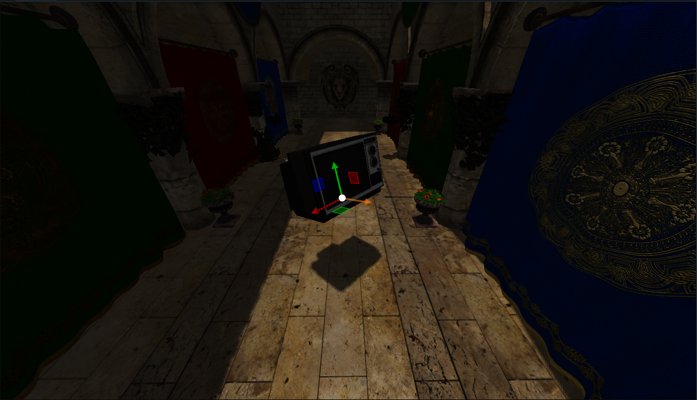

# Flawed Engine

A hobby project developed using C++, OpenGL, Bullet Physics and Lua scripting.

## Table of Contents

- [Features](#features)
- [Scripting Guide](#scripting-guide)
- [Screenshots](#screenshots)
- [Contributing](#contributing)

## Features

- Physics simulation
- Animation
- Animation blending
- Lighting
- (de)Serialization
- Scripting using Lua
- Shadows

## Scripting Guide

For detailed information on scripting using Lua , refer to the [Scripting Guide](ScriptingGuide.html) included in the repository.
The guide provides instructions, examples, and best practices for integrating Lua scripts with the project.

## Screenshots

## Contributing

Contributions are welcome! If you would like to contribute to the project, please follow these guidelines:

1. Fork the repository and create a new branch.
4. Submit a pull request detailing your changes and any related issues.

